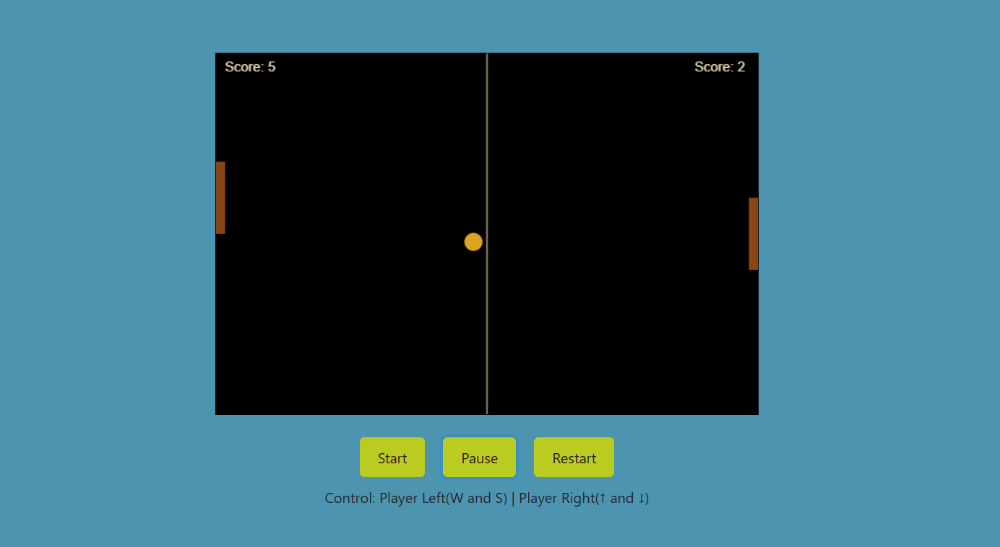
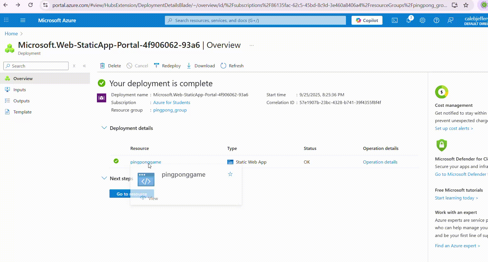

# Ping Pong Game

A ping pong game built with HTML, CSS, and JavaScript.

## Game demo screenshot

## How to Play

- Use W and S keys for the left paddle.
- Use Up and Down arrow keys for the right paddle.
- The first player to reach 10 points wins.

## Controls

- Left Player: W (up), S (down)
- Right Player: ↑ (up), ↓ (down)

## Files

- index.html: Main HTML structure
- style.css: Styling 
- script.js: Game logic

## Running the Game

Open index.html in a web browser to play the game.

## Deploying code to Azure cloud

